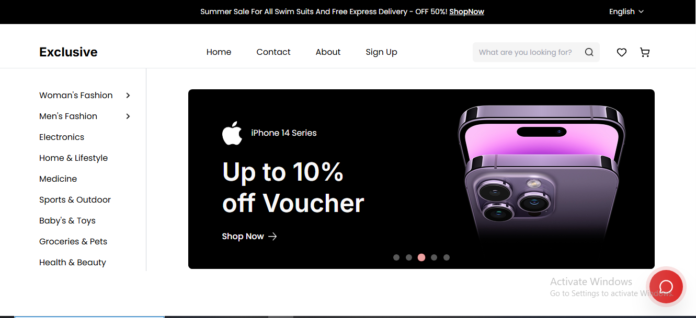
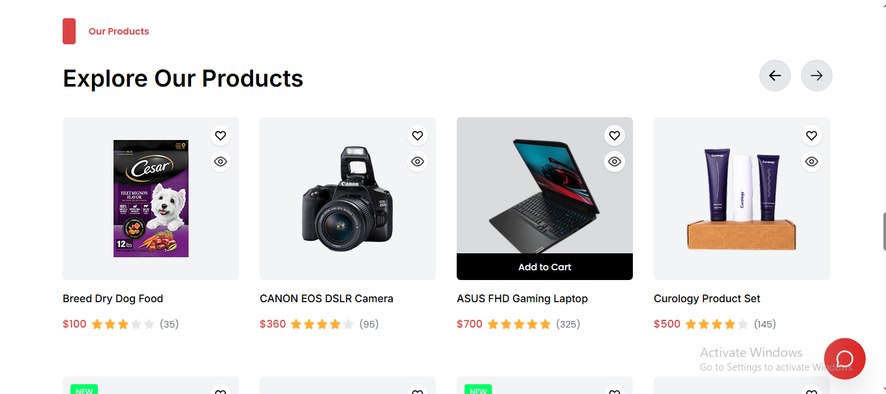
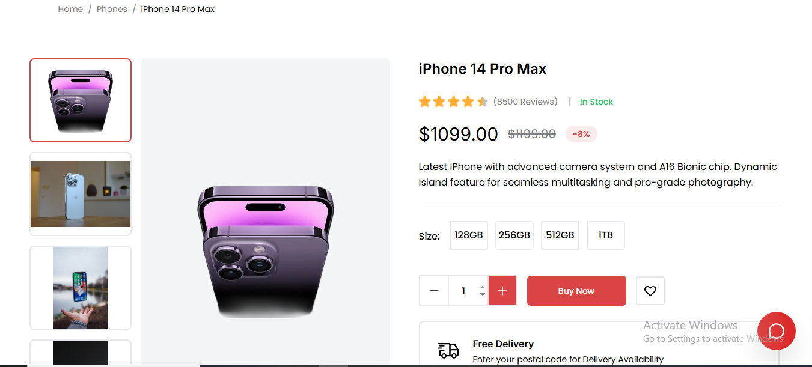

<h1 align="center">🛒 Exclusive Store</h1>

A modern, high-performance <strong>E-Commerce Web App</strong> built with <strong>React + TypeScript + Vite</strong>.  
Includes <strong>multi-language support (EN / AR / ES)</strong> with <strong>RTL</strong>, a <strong>PWA offline experience</strong>, <strong>Supabase</strong> backend, and a built-in <strong>AI-like support chatbot</strong>.  
Designed to feel like a real shopping app — fast, responsive, and polished. ✨

<h2>📸 Preview</h2>

  
    
  
    
  

<h2>🚀 Features</h2>
<ul>
  <li>🛍️ <strong>Full E-Commerce Experience</strong> — browse products, categories, flash sales, best selling, and product details</li>
  <li>🛒 <strong>Cart & Checkout</strong> — add/remove items, quantity updates, coupon UI, and order success flow</li>
  <li>❤️ <strong>Wishlist</strong> — save favorite items and manage them easily</li>
  <li>👤 <strong>Auth & Account</strong> — login/register, forgot/reset password, and account management pages</li>
  <li>🌍 <strong>Internationalization (i18n)</strong> — English / Arabic / Spanish across the whole UI</li>
  <li>↔️ <strong>RTL Support</strong> — Arabic layout works properly with RTL-friendly Tailwind logical properties</li>
  <li>📦 <strong>Dynamic Product Translation</strong> — translated product titles/descriptions stored in Supabase (no manual editing for each product)</li>
  <li>🤖 <strong>Smart Chatbot Widget</strong> — floating support chat with quick replies + auto-responses (EN/AR/ES)</li>
  <li>📱 <strong>Fully Responsive Home Page</strong> — mobile-first layout without breaking the desktop design</li>
  <li>⚡ <strong>PWA Offline App</strong> — installable app-like experience with service worker caching + offline support</li>
  <li>🔐 <strong>Supabase Backend</strong> — products, translations, and auth-ready setup</li>
  <li>🧠 <strong>State Management</strong> — Zustand stores for language, auth, cart, wishlist, orders, reviews, chatbot</li>
</ul>

<h2>📄 Pages & Sections</h2>
<ul>
  <li>🏠 <strong>Home</strong> — top header, header, categories sidebar, hero, flash sales, browse by category, best selling, featured campaign, explore products, new arrival, services, footer</li>
  <li>🛍️ <strong>Shop Pages</strong> — categories, flash sales, best selling, our products</li>
  <li>📦 <strong>Product</strong> — product details + related items</li>
  <li>🛒 <strong>Cart & Checkout</strong> — cart, checkout, order success</li>
  <li>❤️ <strong>Wishlist</strong></li>
  <li>👤 <strong>Account</strong> — profile, orders, cancellations, reviews</li>
  <li>📄 <strong>Static Pages</strong> — about, contact, FAQ, terms of use, privacy policy</li>
  <li>🚫 <strong>404 Page</strong></li>
</ul>

<h2>🛠️ Tech Stack</h2>
<ul>
  <li>⚛️ <strong>React 19</strong> + <strong>TypeScript</strong></li>
  <li>⚡ <strong>Vite</strong> (fast dev + build)</li>
  <li>🎨 <strong>Tailwind CSS</strong> + RTL-friendly logical properties</li>
  <li>🌍 <strong>i18next</strong> + <strong>react-i18next</strong> (EN/AR/ES)</li>
  <li>🧠 <strong>Zustand</strong> (state management)</li>
  <li>🗄️ <strong>Supabase</strong> (database + auth-ready)</li>
  <li>📱 <strong>PWA</strong> via <strong>vite-plugin-pwa</strong> (offline + installable)</li>
  <li>🧩 <strong>ES Modules</strong> (including translation scripts)</li>
</ul>

<h2>🧪 How to Run</h2>
<ol>
  <li>📥 Clone or download this repository</li>
  <li>📦 Install dependencies:
    <pre><code>npm install</code></pre>
  </li>
  <li>🔑 Create <code>.env</code> in the project root and add:
    <pre><code>VITE_SUPABASE_URL=YOUR_SUPABASE_URL
VITE_SUPABASE_ANON_KEY=YOUR_SUPABASE_ANON_KEY</code></pre>
  </li>
  <li>▶️ Start dev server:
    <pre><code>npm run dev</code></pre>
  </li>
  <li>🏗️ Build for production:
    <pre><code>npm run build</code></pre>
  </li>
  <li>👀 Preview production build:
    <pre><code>npm run preview</code></pre>
  </li>
</ol>

<h2>🌍 Product Translation (Automation)</h2>

This project supports translating product <strong>titles</strong> and <strong>descriptions</strong> without manual editing by using a <code>product_translations</code> table in Supabase.

<ul>
  <li>📌 Translation architecture docs: <code>TRANSLATION_GUIDE.md</code></li>
  <li>⚙️ Setup steps: <code>SETUP_INSTRUCTIONS.md</code></li>
  <li>🧪 Example usage: <code>HOW_TO_USE_TRANSLATIONS.tsx</code></li>
</ul>

<h2>📱 PWA (Offline App)</h2>
<ul>
  <li>✅ Installable on mobile/desktop</li>
  <li>✅ Offline caching for assets + smart runtime caching</li>
  <li>📌 Quick guide: <code>PWA_QUICK_START.md</code></li>
  <li>📌 Full guide: <code>PWA_SETUP_GUIDE.md</code></li>
</ul>

<h2>💬 Contact</h2>

📧 Email: <a href="mailto:yousseftalaat142@gmail.com">yousseftalaat142@gmail.com</a>

🔗 LinkedIn: <a href="https://www.linkedin.com/in/youssef-talaat-1aa2671b3/">Youssef Talaat</a>

---

<h3 align="center">✨ Created & Maintained by <strong>Youssef Talaat</strong></h3>
